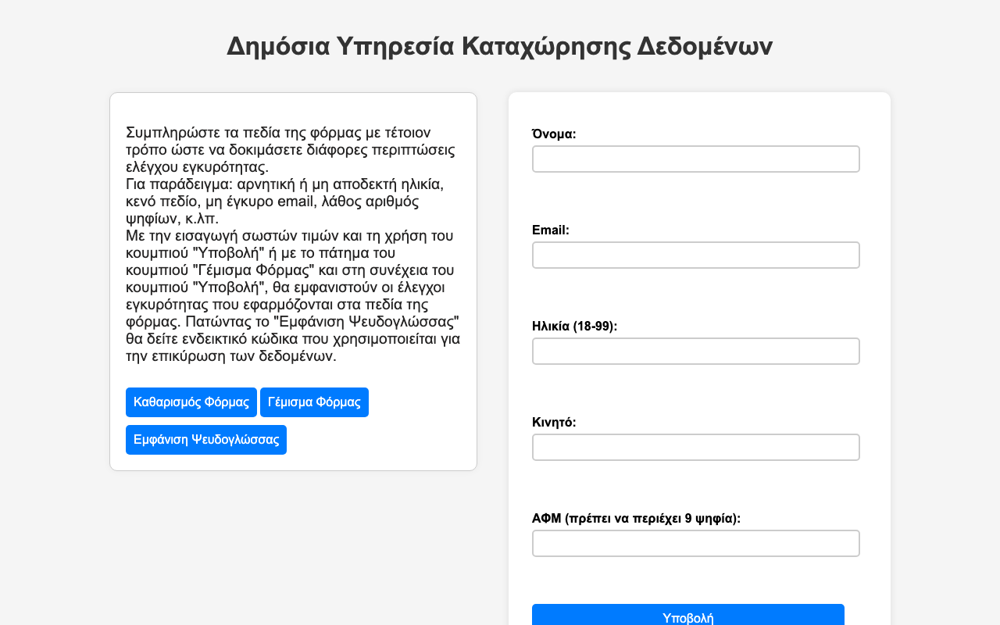
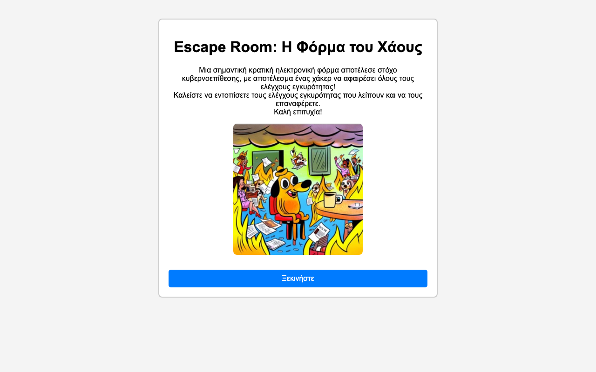

# The Importance of Input Validation — Interactive Lesson

Interactive web activities that teach **input validation** to high-school Computer Science students (Greek Lyceum, Grade 12). The activities are part of a full lesson plan written for the *Didactics of Informatics* (Διδακτική της Πληροφορικής) university course.

Students take on roles ("public-service clerk" and "citizen"), test a real-looking form, and then restore the validation checks that a "hacker" has removed. Along the way they map each JavaScript check to the Greek school pseudocode (ΨΕΥΔΟΓΛΩΣΣΑ) used in the national curriculum.

**[▶ Live demo](https://matinapap.github.io/Teaching-Information-Technology/)** · **[📄 Lesson plan (PDF, Greek)](docs/lesson-plan.pdf)**

> The user interface and the lesson plan are in Greek.

## Activities

### 1. Public Service Data Entry Form

A registration form with live client-side validation for five common fields. Each field shows a clear error message when the input is wrong. When the input is valid, the field shows the exact condition that passed, written as pseudocode, so students can link the behaviour to the algorithm.

| Field | Rule |
| --- | --- |
| Name | Required, at least 2 characters, starts with a Greek capital letter |
| Email | Required, `xx@xx.xx` format |
| Age | Digits only, between 18 and 99 |
| Mobile | 10 digits, starts with `69` |
| Tax ID (ΑΦΜ) | Exactly 9 digits |

The form also includes *Fill Form* and *Clear Form* helpers and a link to the [pseudocode for every check](activity-1-form-validation/solutions.txt).



### 2. Escape Room: "The Form of Chaos"

A hacker has stripped every validation check from a government form. Students work through five levels, and in each one they:

1. fill in the blanks of a `ΑΡΧΗ_ΕΠΑΝΑΛΗΨΗΣ … ΜΕΧΡΙΣ_ΟΤΟΥ` (repeat … until) pseudocode loop, and
2. **drag and drop** the right validation rule onto the drop zone.

Each wrong answer gets a targeted hint, a *Solution* button reveals the answer after a confirmation prompt, and arrow navigation leads to a final "Congratulations" screen.



## Learning Objectives

By the end of the lesson, students should be able to:

- recognise why input validation matters in everyday applications;
- tell apart different kinds of checks (type, range, format) and pick the right one for a problem;
- write simple validation algorithms in pseudocode;
- explain the role of validation in building reliable, secure software.

## Tech Stack

- **HTML5** and **CSS3**
- **Vanilla JavaScript**: regular expressions, DOM manipulation, and the HTML5 Drag and Drop API
- No frameworks, build step, or dependencies

## Running Locally

Clone the repository and open `index.html` in any modern browser:

```bash
git clone https://github.com/matinapap/Teaching-Information-Technology.git
cd Teaching-Information-Technology
open index.html        # macOS. On Windows use: start index.html
```

You can also serve it with a local web server, for example `python3 -m http.server`, and then visit <http://localhost:8000>.

## Project Structure

```
.
├── index.html                     # Landing page linking to both activities
├── activity-1-form-validation/    # Worksheet 1: data entry form with live validation
│   ├── index.html
│   ├── script.js
│   ├── style.css
│   └── solutions.txt              # Pseudocode for each validation check
├── activity-2-escape-room/        # Worksheet 2: drag-and-drop escape room game
│   ├── index.html
│   ├── script.js
│   ├── style.css
│   └── *.png
└── docs/
    ├── lesson-plan.pdf            # Full lesson plan (Greek)
    └── screenshots/
```

## Author

**Matina Papadakou** · [GitHub @matinapap](https://github.com/matinapap)
